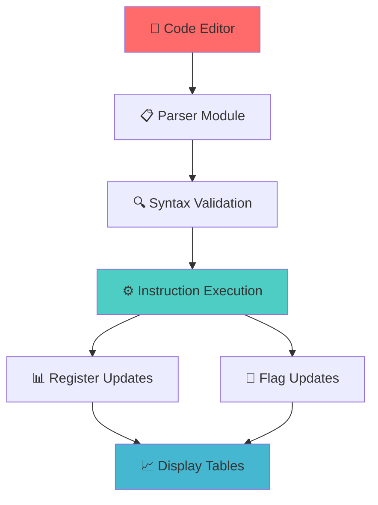

---

# 🔧 **8051 Microcontroller Assembler & Simulator**

<div align="center">


**🚀 Interactive web-based 8051 microcontroller assembler and simulator for educational and development purposes**

[🔧 Features](#-key-features) • [📖 Installation](#-installation) • [🎮 Usage](#-usage) • [🏗️ Architecture](#-system-architecture)

</div>

---

## 🎯 **What This Project Accomplishes**

Transform embedded systems education with an interactive 8051 simulator! This comprehensive tool revolutionizes how students and engineers learn microcontroller programming by:

- **🔧 Real-time Assembly Compilation** - Write and compile 8051 assembly code instantly
- **📊 Live Register Monitoring** - Visualize register and flag changes in real-time
- **🎓 Educational Focus** - Perfect for learning embedded systems programming
- **🌐 Web-based Interface** - No installation of complex IDEs required
- **🔍 Error Detection** - Comprehensive syntax and semantic error checking

---

## ✨ **Key Features**

### 🧠 **Advanced 8051 Instruction Support**
- **📦 Data Transfer**: `MOV` operations with registers and immediate values
- **➕ Arithmetic Operations**: `ADD`, `SUBB`, `INC`, `DEC` with flag updates
- **🔗 Logical Operations**: `ANL`, `ORL`, `XRL`, `CPL` for bit manipulation
- **🔄 Bit Manipulation**: `RL`, `RR`, `RLC`, `RRC`, `SWAP` for data rotation
- **🎯 Register Support**: Complete A, R0-R7, DPTR register set

### 📊 **Real-time Visualization**
- **📈 Live Register Display**: Monitor accumulator and working registers
- **🚩 Flag Status Monitoring**: Track Carry (CY), Auxiliary Carry (AC), Overflow (OV), Parity (P)
- **📋 Program Status Word**: Real-time PSW register visualization
- **🔍 Step-by-step Execution**: Watch how instructions affect system state

### 🎨 **Professional User Interface**
- **✨ Syntax Highlighting**: Assembly code editor with 8051-specific highlighting
- **🌙 Dark Theme**: Modern Monokai theme for comfortable coding
- **📱 Responsive Design**: Works seamlessly on desktop and tablet devices
- **⚡ Real-time Compilation**: Instant feedback on code changes

---

## 🏗️ **System Architecture**



---

## 🚀 **Quick Start Installation**

### Prerequisites
- Python 3.8+
- Modern web browser
- Basic understanding of assembly language

### 1. **Clone & Setup**
```bash
# Clone the repository
git clone https://github.com/het004/8051_Assembler-GUI.git
cd 8051_Assembler-GUI

# Create virtual environment
python -m venv venv
source venv/bin/activate  # Windows: venv\Scripts\activate

# Install dependencies
pip install -r requirements.txt
```

### 2. **Launch the Application**
```bash
streamlit run main.py
```

### 3. **Access the Simulator**
Open your browser and navigate to: `http://localhost:8501`

---

## 🎮 **Usage Examples**

### 📝 **Basic Arithmetic Example**
```assembly
MOV A, #4F      ; Load 4F hex into accumulator
SUBB A, #10     ; Subtract 10 hex from A
ANL A, #0FH     ; AND with 0F hex
CPL A           ; Complement accumulator
```

**Expected Output:**
- **A Register**: `4FH` → `3FH` → `0FH` → `F0H`
- **Flags**: Carry, Overflow, and Parity flags updated accordingly

### 🔄 **Bit Manipulation Example**
```assembly
MOV A, #0AA     ; Load pattern 10101010
RL A            ; Rotate left
RRC A           ; Rotate right through carry
SWAP A          ; Swap nibbles
```

### 📊 **Register Operations Example**
```assembly
MOV R0, #10     ; Load 10 into R0
MOV R1, #20     ; Load 20 into R1
MOV A, R0       ; Transfer R0 to A
ADD A, R1       ; Add R1 to A
```

---

## 🛠️ **Supported Instructions**

| **Category** | **Instructions** | **Description** |
|--------------|-----------------|-----------------|
| **📦 Data Transfer** | `MOV A, #data` | Move immediate data to accumulator |
|  | `MOV A, Rn` | Move register to accumulator |
|  | `MOV Rn, #data` | Move immediate data to register |
| **➕ Arithmetic** | `ADD A, #data` | Add immediate data to A |
|  | `SUBB A, #data` | Subtract with borrow from A |
|  | `INC A/Rn` | Increment accumulator/register |
|  | `DEC A/Rn` | Decrement accumulator/register |
| **🔗 Logical** | `ANL A, #data` | Logical AND with A |
|  | `ORL A, #data` | Logical OR with A |
|  | `XRL A, #data` | Logical XOR with A |
|  | `CPL A` | Complement accumulator |
| **🔄 Rotation** | `RL A` | Rotate A left |
|  | `RR A` | Rotate A right |
|  | `RLC A` | Rotate A left through carry |
|  | `RRC A` | Rotate A right through carry |
|  | `SWAP A` | Swap nibbles in A |

---

## 📁 **Project Structure**

```
🔧 8051_Assembler-GUI/
├── 🚀 main.py                      # Application entry point
├── 🎨 assembler_gui.py             # Streamlit UI implementation
├── 📋 parser.py                    # Assembly code parser
├── ⚙️ executor.py                  # Instruction execution engine
├── 📊 state.py                     # Register and flag definitions
├── 🚩 flags.py                     # Flag update logic
├── 🛠️ utils.py                     # Utility functions
├── 📦 requirements.txt             # Project dependencies
├── 📁 Instructions/                # Instruction implementations
│   ├── 🧮 arithmetic.py           # Arithmetic operations
│   ├── 🔗 logic.py                # Logical operations
│   ├── 📦 data_transfer.py        # Data transfer operations
│   ├── 🔄 shift_rotate.py         # Bit manipulation operations
│   └── 🎯 control_flow.py         # Control flow operations (future)
└── 📖 README.md                   # Project documentation
```

---

## 🎯 **Use Cases & Applications**

### 🎓 **Educational Institutions**
- **Microcontroller Courses**: Interactive learning tool for embedded systems
- **Laboratory Sessions**: Hands-on programming without hardware requirements
- **Assignment Grading**: Quick verification of student assembly programs
- **Concept Demonstration**: Visual representation of instruction execution

### 👨‍💻 **Professional Development**
- **Algorithm Testing**: Quick prototyping of embedded algorithms
- **Code Verification**: Testing assembly routines before hardware implementation
- **Training Programs**: Corporate embedded systems training
- **Interview Preparation**: Practice assembly programming concepts

### 🔬 **Research & Development**
- **Algorithm Development**: Research new embedded processing techniques
- **Academic Papers**: Generate examples and demonstrations
- **Proof of Concepts**: Validate theoretical concepts practically
- **Student Projects**: Final year and graduate project development

---

## 🌟 **Technical Specifications**

| **Aspect** | **Details** |
|------------|-------------|
| **🎯 Target Architecture** | Intel 8051 Microcontroller |
| **📝 Supported Formats** | Hexadecimal (#4FH), Decimal (#79), Binary |
| **📊 Register Coverage** | A, R0-R7, DPTR, PSW |
| **🚩 Flag Support** | CY, AC, OV, P flags |
| **🔧 Instruction Count** | 20+ core instructions |
| **⚡ Performance** | Real-time execution simulation |

---

## 🔮 **Future Enhancements**

### 🚧 **Planned Features**
- [ ] 🎯 **Complete Instruction Set** - Support all 255 8051 instructions
- [ ] 🗂️ **Memory Visualization** - Internal and external RAM display
- [ ] ⏰ **Timer/Counter Simulation** - Complete peripheral simulation
- [ ] 📱 **Mobile App** - React Native mobile application
- [ ] 🔌 **Hardware Integration** - Connect to real 8051 development boards
- [ ] 📊 **Code Analysis** - Performance metrics and optimization suggestions

### 🎨 **UI/UX Improvements**
- [ ] 🎨 **Multiple Themes** - Light/dark theme options
- [ ] 💾 **Project Management** - Save and load assembly projects
- [ ] 🔍 **Advanced Debugger** - Breakpoints and step-through debugging
- [ ] 📈 **Execution Statistics** - Instruction count and timing analysis

---

## 📚 **Learning Resources**

### 📖 **8051 Microcontroller Basics**
The 8051 microcontroller, developed by Intel in 1980, features:
- **8-bit CPU** with Harvard architecture
- **4KB ROM** and **128 bytes RAM** on-chip
- **32 I/O pins** for interfacing
- **2 Timer/Counters** for timing operations
- **5 Interrupt sources** for real-time processing

### 🎯 **Programming Tips**
1. **Register Optimization**: Use working registers (R0-R7) for temporary storage
2. **Flag Awareness**: Monitor carry and overflow flags for arithmetic operations
3. **Addressing Modes**: Understand immediate, register, and direct addressing
4. **Memory Management**: Efficiently use internal RAM space

---

## 🤝 **Contributing**

We welcome contributions from embedded systems enthusiasts and educators!

### 🛠️ **How to Contribute**
1. **🍴 Fork** the repository
2. **🌿 Create** your feature branch (`git checkout -b feature/NewInstruction`)
3. **🔧 Add** new instructions or features
4. **💾 Commit** your changes (`git commit -m 'Add SFR support'`)
5. **📤 Push** to the branch (`git push origin feature/NewInstruction`)
6. **🎯 Open** a Pull Request

### 🎯 **Contribution Areas**
- **📝 New Instructions**: Implement additional 8051 instructions
- **🎨 UI Improvements**: Enhance user interface and experience
- **🔧 Bug Fixes**: Resolve issues and improve stability
- **📖 Documentation**: Improve guides and examples
- **🧪 Test Cases**: Add comprehensive test coverage

---

## 🐛 **Troubleshooting**

<details>
<summary><strong>🔧 Common Issues & Solutions</strong></summary>

**Q: "ModuleNotFoundError: No module named 'state'"**
```bash
# Ensure you're in the correct directory and state.py exists
ls -la state.py
python main.py
```

**Q: Invalid instruction error**
```bash
# Check syntax: Use #10H for hex, not #10
# Verify register names: Use A, R0-R7
# Example: MOV A, #4FH (correct) vs MOV A, #4F (incorrect)
```

**Q: UI not loading properly**
```bash
# Clear Streamlit cache
streamlit cache clear
# Restart the application
streamlit run main.py --server.port 8502
```

</details>

---

## 📞 **Contact & Support**

<div align="center">

**👨‍💻 Developer**: [het004](https://github.com/het004)

[](https://github.com/het004)
[](https://www.linkedin.com/in/het-shah-a29225248/)
[](mailto:hetshah1718@gmail.com)

**🐛 Issues**: [Report bugs](https://github.com/het004/8051_Assembler-GUI/issues) | **💡 Feature Requests**: [Suggest features](https://github.com/het004/8051_Assembler-GUI/discussions)

</div>

---

## 📜 **License**

This project is licensed under the MIT License - see the [LICENSE](LICENSE) file for details.

---

## 🙏 **Acknowledgments**

<div align="center">

**🌟 Special Thanks To:**

- **🎓 Intel Corporation** - For the 8051 microcontroller architecture
- **🚀 Streamlit Team** - For the excellent web framework
- **👨‍🎓 Educational Community** - For feedback and testing
- **💻 Open Source Contributors** - For inspiration and guidance

</div>

---

<div align="center">

**⭐ Star this repository if you found it helpful!**

*Built with ❤️ for embedded systems education and development*


</div>

---
